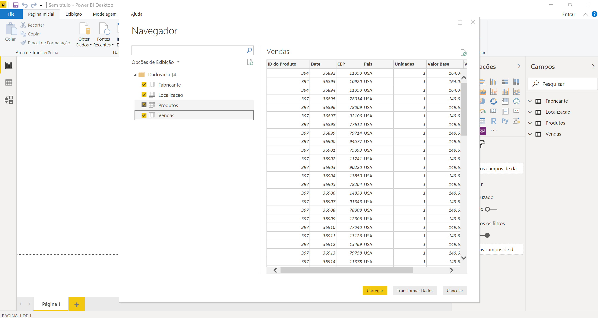

# Power BI - Passo a Passo para demonstração

## Configurar Power BI

Antes de começarmos, importante certificar de que o Power BI está em Português Brasileiro para o passo a passo abaixo.

Para isso, vá a File > Opções e Configurações > Opções

Verifique na aba Configurações Regionais se o idioma está em Português Brasileiro.

## Get Data (Obter Dados)

Para o workshop, primeiramente navegue até o link abaixo
https://github.com/LucasCosas/Power_BI/blob/master/Demo%20Excel/_OLD/Dados.xlsx.

Clique em "Download" e salve o arquivo de excel no diretório C:/ArquivoExcel

No Power BI Desktop, vá para GetData e escolha a conexão de Arquivo de Excel

Procure a tabela de Excel no diretório salvo no passo anterior.

O Power BI encontrará, dentro do arquivo do Excel, algumas tabelas que podem ser utilizadas para carregar os dados dentro do modelo.

Note que podemos clicar em alguma das tabelas e visualizar um preview dos dados que serão carregados.

Neste caso, utilizaremos apenas os dados formatados nas abas dentro do arquivo excel:

Na caixa de seleção, escolha:

* *Localizacao*
* *Fabricante*
* *Vendas* 
* *Produtos*

Clique em "Editar" após selecionar as tabelas acima.

# Edit Queries (Editar Consultas)

Editar Consultas é o lugar onde você fará as edições nas tabelas que serão feitas as cargas para o modelo do Power BI. É importante fazer as modificações necessárias antes da criaçao das visualizações.

### Tabela Vendas

Alterar os tipos de dados das colunas:

Para alterar, clique no símbolo que aparece ao lado esquerdo da coluna, exemplo abaixo.

Date: Alterar para Data.
Valor Base: Decimal Fixo.
Valor da Venda: Decimal Fixo.

### Tabela Localização

Selecione a tabela Endereço. Na aba Transformar do menu superior, escolha Dividir Coluna por Delimitador

Na tela que abrir, escolha delimitador de vírgula e clique OK.

Renomeie a coluna Endereço.1 para Cidade e Endereço.2 para Estado. Clique com o botão direito em cima do nome da coluna para renomea-la.

### Tabela Fabricante 

Após a carga de dados, vá na terceira opção no menu canto esquerdo do Power BI, onde vemos as relações entre as tabelas. 

## TODO 2: arrumar as identificações automáticas abaixo
A relação entre as tabelas foi identificada automaticamente pelo campo Owner, conforme imagem abaixo

## TODO 2: Revisar a demo abaixo

## Measures (medidas) e Hierarquias

Volte para a primeira opção no menu da esquerda, na aba de visualizações

Clique com o botão direito em "VENDAS" e escolha criar uma nova medida

Copie o código abaixo na aba que aparecer:

> Valor da Nota = sum(FAT_Vendas[Preco])*sum(FAT_Vendas[Quantidade_Vendida])

Para criar uma hierarquia, basta arrastar uma coluna em outra, dentro da mesma tabela: 

Arraste NM_Produto para Nome_Departamento da tabela PRODUTOS

## Visualizações

### Objetivos da visualização:

Descubra quem é o melhor vendedor com filtro de departamento e de data.
Qual produto tem a maior venda? E qual tem o menor?

### Criar visualização

Na área de VISUALIZAÇÕES, escolha a visualização para colocar filtros (a primeira opção da 5ª linha, da área de visualizações), depois, procure a coluna DateTime da tabela DIM_DATA e selecione o checkbox.

Clique fora da visualização criada e adicione um novo filtro, com NM_Departamento desta vez.

Clique novamente fora da visualização criada acima e selecione o gráfico de colunas empilhadas.

Escolha a medida calculada criada no passo anterior (Valor da nota) e coloque-a no campo de Valor(coluna), se apenas clicar no checkbox, o Power BI entende essa coluna como numérica e faz isso por você. No campo de eixo, adicione o nome dos vendedores da tabela DIM_Vendedores. Novamente, apenas clicar no checkbox funciona automaticamente.

Com os passos acima podemos filtrar datas e departamentos para descobrir quem vendeu mais nas datas e departamentos escolhidos.

Adicione outro gráfico de colunas, desta vez, o gráfico de colunas empilhadas e linha. Selecione valor da nota e nm_produto.

Na linha de valor, escolha a coluna Target_Value da tabela FAT_Target.

Agora podemos modificar com o filtro de data para alterar as visualizações criadas.

A partir daí, o céu é o limite.

## Publicação e compartilhamento

Após criar as visualizações, clique em "Publicar" no menu inicial do Power BI

Quando abrir a caixa de diálogo, coloque seu email corporativo e senha.

Escolha o espaço de trabalho pessoal e publique.

Clique no link para visualizar o relatório no site ou abra o "msit.powerbi.com"

Na opção "Arquivo" podemos compartilhar este relatório na web ou SharePoint. Na opção "Compartilhar" podemos compartilhar com um grupo ou usuário específico.

### Teams

Abra o Teams na aba de teams. Escolha um time que gostaria de compartilhar o relatório criado e clique no sinal "+". Procure por Power BI na área de adicionar uma aba.	 Selecione o espaço de trabalho em que o relatório foi publicado e selecione-o.

## Atualizando o relatório

Por fim, para atualizar o relatório no site do Power BI, podemos navegar até o espaço de trabalho, na área esquerda, procurar por Data Sources/Conjuntos de Dados, clicar na reticências ao lado do conjunto de dados e clicar em "Atualizar Agora".

Note que este passo só funcionará se o arquivo utilizado estiver em algum serviço online como SharePoint. Se estiver na máquina física, será necessário publica-lo novamente a partir do Power BI Desktop ou criar um gateway(não recomendável).