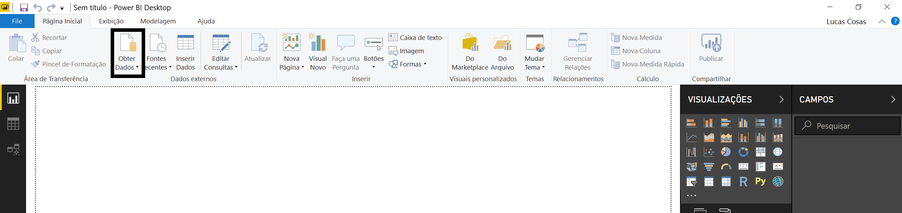

# Power BI - Passo a Passo para demonstração

## Configurar Power BI

Antes de começarmos, importante certificar de que o Power BI está em Português Brasileiro para o passo a passo abaixo.

Para isso, vá a File > Opções e Configurações > Opções

Verifique na aba Configurações Regionais se o idioma está em Português Brasileiro.

## Get Data (Obter Dados)

Para o workshop, primeiramente navegue até o link abaixo
https://github.com/LucasCosas/Power_BI/blob/master/Demo%20Excel/_OLD/Dados.xlsx.

Clique em "Download" e salve o arquivo de excel no diretório C:/ArquivoExcel

No Power BI Desktop, vá para GetData e escolha a conexão de Arquivo de Excel

Procure a tabela de Excel no diretório salvo no passo anterior.

O Power BI encontrará, dentro do arquivo do Excel, algumas tabelas que podem ser utilizadas para carregar os dados dentro do modelo.

Note que podemos clicar em alguma das tabelas e visualizar um preview dos dados que serão carregados.

Neste caso, utilizaremos apenas os dados formatados nas abas dentro do arquivo excel:

Na caixa de seleção, escolha:

* *Localizacao*
* *Fabricante*
* *Vendas* 
* *Produtos*

Clique em "Transformar Dados" após selecionar as tabelas acima. 

Caso as tabelas já estejam carregadas, pode-se ir ao menu de edições clicando em Editar Consultas do menu superior na página principal do Power BI

# Edit Queries (Editar Consultas)

Editar Consultas é o lugar onde você fará as edições nas tabelas que serão feitas as cargas para o modelo do Power BI. É importante fazer as modificações necessárias antes da criaçao das visualizações.

### Tabela Vendas

Alterar os tipos de dados das colunas:

Para alterar, clique no símbolo que aparece ao lado esquerdo da coluna, exemplo abaixo.

Date: Alterar para Data.
Valor Base: Decimal Fixo.

### Tabela Localização

Selecione a tabela Endereço. Na aba Transformar do menu superior, escolha Dividir Coluna por Delimitador

Na tela que abrir, escolha delimitador de vírgula e clique OK.

Renomeie a coluna Endereço.1 para Cidade e Endereço.2 para Estado. Clique com o botão direito em cima do nome da coluna para renomea-la.

### Tabela Fabricante 

A coluna Fabricante está num formato onde as colunas são as linhas, portanto, precisamos transpor os dados.

Na aba de Transformação, clique em Transpor:

Clique também em "Usar a Primeira Linha como Cabeçalho".

A Tabela ficará parecida com isso:

Volte para a Aba "Página Inicial" no menu superior e clique em "Fechar e Aplicar"

Isso fará com que as Mudanças nas Consultas sejam aplicadas no Modelo para visualizações.

# Relacionamento das Tabelas

Na página principal do Power BI, escolha a terceira opção do menu lateral esquerdo, para ver as relações entre as tabelas.

As relações entre as tabelas foi identificada automaticamente pelo campo CEP (Localização) e ID (Produto), conforme imagem abaixo

Porém, a relação entre Fabricante e Produtos não foi identificada. Para tanto, podemos fazê-la de duas formas diferentes:

A primeira é simplesmente clicar no campo "ManufacturerID" e arrasta-lo até "Fabricante - No".

Outra forma, no menu superior, procurar por "Gerenciar Relações" e criar a nova relação na caixa de diálogo.

Resultado esperado:

# Measures (medidas) e Hierarquias

Volte para a primeira opção no menu da esquerda, na aba de visualizações

Clique com o botão direito na tabela "Vendas" e escolha criar uma "Nova Coluna"

Copie o código abaixo na aba que aparecer:

> Valor da Nota = Vendas[Valor Base] * Vendas[Unidades]

Isso criará uma Coluna na tabela, que multiplica a quantidade de unidades vendida pelo valor base de cada unidade, resultando no preço final da Nota.

Para criar uma nova Medida, clique com o botão direito na tabela Vendas e "Nova Medida".

Copie o código abaixo e cole na aba que aparecer:

> Valor Total de Vendas = Vendas[Valor da Nota]

Isso criará uma medida que agrega todos os valores das notas, para calcular o valor total das vendas num determinado período ou por um produto específico.

Para criar uma hierarquia, basta arrastar uma coluna em outra, dentro da mesma tabela: 

Na tabela Produtos, arraste Produto para Fabricante, criando uma hierarquia entre Fabricante > Produto.

Para o Power BI então qual o tipo da coluna de localização, precisaremos colocar labels em cada coluna:

Na tabela Localização, clique na coluna CEP, procure por Categoria de dados e selecione CEP na lista suspensa:

Faça o mesmo para as seguintes colunas:

* *Cidade: Cidade*
* *Estado: Estado ou Província*
* *País: País/Região*

# Visualizações

## Criar visualização

Escolha a visualização de mapa na área de Visualizações:

Clique na coluna País da tabela Localização e arraste até o campo Localização da visualização de mapa selecionada:

Faça o mesmo com Estado e Cidade, arrastando para baixo de "País" no campo de Localização.

No campo "Tamanho", coloque a coluna que criamos "Valor da Nota". Isso fará com que as localizações mais vendidas tenham bolas maiores

Adicione um filtro para Datas, selecionando "Segmentação de Dados" e o campo Date da tabela Vendas

Adicione o Cartão e coloque Valor da Nota como Campo.

Coloque um Gráfico de Rosca e em Legenda, adicione Categorias, em valores "Valor da Nota"

Adicione mais um filtro (Segmentação de dados) para Fabricante.

Clique em gráfico de barras empilhadas e adicione os campos de Produto da tabela Produtos e Valor de Nota da tabela Vendas. Esta visualização virá com muitos valores, filtraremos os 10 maiores:

Ranking top 10:

* Com a visualização do gráfico selecionada, arraste o filtro Produto para o campo "Filtros neste Visual" na aba Filtros. 
* em Tipo de Filtro, mude para N superior. Coloque o valor "10" em mostrar itens > Superior.
* em "Por Valor" adicione Valor da Nota e clique em aplicar.

Exemplo abaixo contendo o filtro de ranking e algumas visualizações possíveis

# Publicação e compartilhamento

Após criar as visualizações, clique em "Publicar" no menu inicial do Power BI

Quando abrir a caixa de diálogo, coloque seu email corporativo e senha.

Escolha o espaço de trabalho pessoal e publique.

Clique no link para visualizar o relatório no site ou abra o "msit.powerbi.com"

Na opção "Arquivo" podemos compartilhar este relatório na web ou SharePoint. Na opção "Compartilhar" podemos compartilhar com um grupo ou usuário específico.

## Teams

Abra o Teams na aba de teams. Escolha um time que gostaria de compartilhar o relatório criado e clique no sinal "+". Procure por Power BI na área de adicionar uma aba.	 Selecione o espaço de trabalho em que o relatório foi publicado e selecione-o.

# Atualizando o relatório

Por fim, para atualizar o relatório no site do Power BI, podemos navegar até o espaço de trabalho, na área esquerda, procurar por Data Sources/Conjuntos de Dados, clicar na reticências ao lado do conjunto de dados e clicar em "Atualizar Agora".

Note que este passo só funcionará se o arquivo utilizado estiver em algum serviço online como SharePoint. Se estiver na máquina física, será necessário publica-lo novamente a partir do Power BI Desktop ou criar um gateway(não recomendável).

